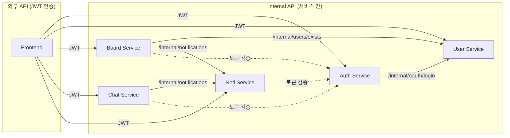

# weAlist - 협업 프로젝트 관리 플랫폼

weAlist는 팀 협업을 위한 프로젝트 관리 플랫폼입니다. 워크스페이스 기반의 프로젝트 관리, 실시간 채팅, 알림 기능을 제공합니다.

---

## 목차

- [아키텍처 개요](#아키텍처-개요)
- [서비스 구성](#서비스-구성)
- [기술 스택](#기술-스택)
- [시작하기](#시작하기)
- [Kubernetes 배포](#kubernetes-배포)
- [아키텍처 결정 기록](#아키텍처-결정-기록)

---

## 아키텍처 개요

```
┌─────────────────────────────────────────────────────────────┐
│                        Client (Browser)                     │
└─────────────────────────────────────────────────────────────┘
                              │
                              ▼
┌─────────────────────────────────────────────────────────────┐
│                    NGINX (API Gateway) :80                  │
│   /api/auth/*  /api/users/*  /api/boards/*  /api/chats/*    │
└─────────────────────────────────────────────────────────────┘
                              │
         ┌────────────────────┼────────────────────┐
         ▼                    ▼                    ▼
┌─────────────┐     ┌─────────────┐     ┌─────────────┐
│   Frontend  │     │    User     │     │    Auth     │
│  React+Vite │     │   Go+Gin    │     │ Spring Boot │
│    :3000    │     │    :8080    │     │    :8090    │
└─────────────┘     └──────┬──────┘     └──────┬──────┘
                           │                   │
                           ▼                   ▼
                    ┌─────────────┐     ┌─────────────┐
                    │  PostgreSQL │     │    Redis    │
                    │ (user_db)   │     │ (토큰 저장)   │
                    └─────────────┘     └─────────────┘

         ┌─────────────────┼────────────────────┐
         ▼                 ▼                    ▼
┌─────────────┐     ┌─────────────┐     ┌─────────────┐
│    Board    │     │    Chat     │     │    Noti     │
│   Go+Gin    │     │   Go+Gin    │     │   Go+Gin    │
│    :8000    │     │    :8001    │     │    :8002    │
└──────┬──────┘     └──────┬──────┘     └──────┬──────┘
       │                   │                   │
       ▼                   ▼                   ▼
┌─────────────┐     ┌─────────────┐     ┌─────────────┐
│  PostgreSQL │     │  PostgreSQL │     │  PostgreSQL │
│ (board_db)  │     │  (chat_db)  │     │  (noti_db)  │
└─────────────┘     └─────────────┘     └─────────────┘
```

### 서비스 간 통신



---

## 디렉토리 구조

```
wealist-project-advanced/
├── argocd/                    # ArgoCD 앱 정의
│   └── apps/
│       ├── project.yaml
│       ├── root-app.yaml
│       ├── infrastructure.yaml
│       └── {service}.yaml
│
├── docker/                    # Docker 관련 파일
│   ├── compose/
│   │   └── docker-compose.yml # 로컬 개발용 (전체)
│   ├── env/
│   │   └── .env.dev.example
│   ├── init/postgres/
│   ├── nginx/
│   └── scripts/
│       ├── dev.sh
│       └── clean.sh
│
├── docs/                      # 문서
│   └── K8S_SETUP.md
│
├── infrastructure/            # 인프라 Kustomize
│   ├── base/
│   │   ├── postgres/
│   │   └── redis/
│   └── overlays/
│       ├── local/
│       └── eks/
│
├── services/                  # 애플리케이션 서비스
│   ├── user-service/          # Go + Gin
│   │   ├── docker/Dockerfile
│   │   ├── docker-compose.yml # 단독 실행용
│   │   └── k8s/
│   ├── auth-service/          # Spring Boot
│   │   ├── Dockerfile
│   │   ├── docker-compose.yml
│   │   └── k8s/
│   ├── board-service/         # Go + Gin
│   ├── chat-service/          # Go + Gin
│   ├── noti-service/          # Go + Gin
│   └── frontend/              # React + Vite
│
├── Makefile                   # 빌드/배포 명령어
└── README.md
```

---

## 서비스 구성

| 서비스            | 기술                      | 포트         | 설명                      |
| ----------------- | ------------------------- | ------------ | ------------------------- |
| **Frontend**      | React + Vite + TypeScript | 3000 (→5173) | 웹 UI                     |
| **User Service**  | Go 1.24 + Gin             | 8080         | 사용자, 워크스페이스 관리 |
| **Auth Service**  | Spring Boot 3 + Java 21   | 8090         | JWT 토큰 관리, OAuth 인증 |
| **Board Service** | Go 1.24 + Gin             | 8000         | 프로젝트, 보드, 댓글 관리 |
| **Chat Service**  | Go 1.24 + Gin             | 8001         | 실시간 채팅 (WebSocket)   |
| **Noti Service**  | Go 1.24 + Gin             | 8002         | 알림 관리 (SSE)           |

### 인프라

| 서비스         | 포트       | 설명             |
| -------------- | ---------- | ---------------- |
| **NGINX**      | 80         | API Gateway      |
| **PostgreSQL** | 5432       | 데이터베이스     |
| **Redis**      | 6379       | 캐시/세션        |
| **MinIO**      | 9000, 9001 | S3 호환 스토리지 |

### 데이터베이스

| 서비스        | 데이터베이스     | 주요 테이블                             |
| ------------- | ---------------- | --------------------------------------- |
| User Service  | wealist_user_db  | users, workspaces, workspace_members    |
| Board Service | wealist_board_db | projects, boards, comments, attachments |
| Chat Service  | wealist_chat_db  | chats, messages, chat_participants      |
| Noti Service  | wealist_noti_db  | notifications, notification_preferences |
| Auth Service  | Redis            | refresh_tokens, blacklist               |

---

## 기술 스택

### Backend

- **Go 1.24 + Gin** - User, Board, Chat, Noti Service
- **Spring Boot 3 + Java 21** - Auth Service
- **PostgreSQL 17** - 관계형 데이터베이스
- **Redis 7.2** - 캐시 및 토큰 저장소
- **MinIO** - S3 호환 오브젝트 스토리지

### Frontend

- **React 18** + **Vite**
- **TypeScript**
- **TailwindCSS**

### Infrastructure

- **Docker** + **Docker Compose** - 컨테이너화
- **Kustomize** - Kubernetes 매니페스트 관리
- **ArgoCD** - GitOps 기반 배포
- **NGINX** - API Gateway / 리버스 프록시

---

## 시작하기

### 사전 요구사항

- Docker & Docker Compose
- (선택) kubectl & kustomize (K8s 배포 시)

### 로컬 개발 환경 (Docker Compose)

```bash
# 1. 환경 변수 설정
cp docker/env/.env.dev.example docker/env/.env.dev

# 2. 전체 서비스 시작
make dev-up
# 또는
./docker/scripts/dev.sh up

# 3. 서비스 접속
# - Frontend: http://localhost:3000
# - API Gateway: http://localhost:80
# - MinIO Console: http://localhost:9001

# 4. 로그 확인
make dev-logs

# 5. 서비스 종료
make dev-down
```

### 개별 서비스 실행

각 서비스는 독립적으로 실행할 수 있습니다:

```bash
# 인프라만 먼저 시작
docker compose -f docker/compose/docker-compose.yml up postgres redis minio -d

# 개별 서비스 실행
cd services/board-service
docker compose up

# 또는 다른 서비스
cd services/user-service
docker compose up
```

### 개별 서비스 빌드

```bash
# 모든 서비스 이미지 빌드
make build-all

# 특정 서비스만 빌드
make build-user-service
make build-board-service
```

---

## Kubernetes 배포

### Local (Minikube/Kind)

```bash
# 1. 이미지 빌드
make build-all

# 2. 배포
make k8s-apply-local

# 3. 상태 확인
kubectl get pods -n wealist-dev

# 4. 삭제
make k8s-delete-local
```

### EKS 배포

```bash
# 1. 환경 변수 설정
export AWS_ACCOUNT_ID=123456789012
export AWS_REGION=ap-northeast-2
export IMAGE_TAG=v1.0.0
export RDS_ENDPOINT=wealist-db.xxx.rds.amazonaws.com

# 2. 배포
make k8s-apply-eks
```

### ArgoCD 사용

```bash
# ArgoCD 앱 배포
make argocd-apply

# ArgoCD UI 접속
kubectl port-forward svc/argocd-server -n argocd 8080:443
```

자세한 내용은 [docs/K8S_SETUP.md](docs/K8S_SETUP.md) 참조

---

## Makefile 명령어

```bash
make help              # 사용 가능한 명령어 목록

# Development
make dev-up            # Docker Compose로 전체 서비스 시작
make dev-down          # 서비스 종료
make dev-logs          # 로그 확인

# Build
make build-all         # 모든 서비스 이미지 빌드
make build-<service>   # 특정 서비스 빌드

# Kubernetes
make k8s-apply-local   # Local 환경에 배포
make k8s-apply-eks     # EKS 환경에 배포
make kustomize-<svc>   # Kustomize 미리보기

# ArgoCD
make argocd-apply      # ArgoCD 앱 배포

# Utility
make status            # 현재 상태 확인
make clean             # 정리
```

---

## 아키텍처 결정 기록 (ADR)

### ADR-001: 마이크로서비스 아키텍처 선택

**상황:** 협업 플랫폼의 여러 도메인을 어떻게 구성할 것인가?

**결정:** 도메인별 마이크로서비스 분리

**이유:**

- 각 도메인의 독립적인 배포 및 확장 가능
- 팀별 독립적인 개발 가능
- 장애 격리 (한 서비스 장애가 전체에 영향 X)

---

### ADR-002: 서비스별 데이터베이스 분리 (Database per Service)

**상황:** 마이크로서비스들이 데이터베이스를 공유할 것인가?

**결정:** 서비스별 독립 데이터베이스 사용

**이유:**

- 서비스 간 데이터 결합도 최소화
- 독립적인 스키마 변경 가능
- 서비스별 최적화된 DB 선택 가능

---

### ADR-003: Internal API 패턴

**상황:** 서비스 간 통신을 어떻게 처리할 것인가?

**결정:** REST 기반 Internal API 사용

```
외부 API: /api/users/*     (JWT 인증 필요)
내부 API: /internal/*      (내부망만 접근)
```

**이유:**

- 외부 API와 내부 API 분리로 보안 강화
- NGINX에서 `/internal/*` 라우팅 차단으로 외부 접근 방지

---

### ADR-004: 모노레포 + Kustomize

**상황:** 레포지토리와 K8s 매니페스트 관리를 어떻게 할 것인가?

**결정:** 모노레포 유지 + Kustomize로 환경별 설정 관리

**이유:**

- 현재 팀 규모에서 모노레포가 관리 용이
- Kustomize의 base/overlays 패턴으로 환경별 설정 분리
- Helm보다 간단하고 직관적인 구조

---

### ADR-005: ArgoCD (GitOps)

**상황:** EKS 배포를 어떻게 자동화할 것인가?

**결정:** ArgoCD 사용

**이유:**

- Git 저장소가 Single Source of Truth
- 선언적 배포로 상태 추적 가능
- 자동 동기화 및 롤백 지원

---

### ADR-006: 환경별 네임스페이스 전략

**상황:** Kubernetes 네임스페이스를 어떻게 구성할 것인가?

**결정:** 환경별 네임스페이스 (`wealist-dev`, `wealist-prod`)

```
EKS Cluster
├── wealist-dev          # 개발 환경 (모든 서비스)
├── wealist-prod         # 프로덕션 환경 (모든 서비스)
├── argocd               # ArgoCD
└── monitoring           # Prometheus, Grafana
```

**비교 분석:**

| 전략              | 장점                                | 단점               |
| ----------------- | ----------------------------------- | ------------------ |
| **환경별 (채택)** | 서비스 간 통신 간단, RBAC 관리 쉬움 | 환경 많아지면 복잡 |
| 서비스별          | 서비스 독립성 극대화                | Cross-NS 통신 복잡 |
| 단일 NS           | 가장 단순                           | 환경 격리 불가     |

---

### ADR-007: Health Check 분리 (Liveness vs Readiness)

**상황:** Kubernetes에서 Pod 상태를 어떻게 체크할 것인가?

**결정:** Liveness와 Readiness 프로브 분리

```yaml
livenessProbe: # 서비스 자체가 살아있는지 (DB 무관)
  path: /health/live

readinessProbe: # 트래픽 수신 가능한지 (DB 연결 포함)
  path: /health/ready
```

**이유:**

- DB 일시적 장애 시 Pod 재시작 방지 (Liveness)
- DB 연결 안 되면 트래픽 차단 (Readiness)
- 안정적인 롤링 업데이트 지원

---

## 기여하기

1. Feature 브랜치 생성: `git checkout -b feature/amazing-feature`
2. 커밋: `git commit -m 'Add amazing feature'`
3. 푸시: `git push origin feature/amazing-feature`
4. Pull Request 생성

---

## 라이선스

This project is licensed under the MIT License.
